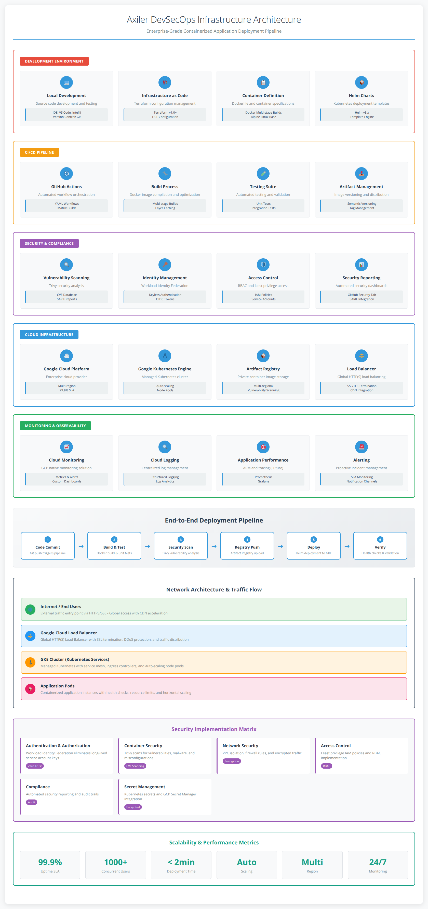

# Axiler - DevSecOps Showcase

This repository contains the complete infrastructure and CI/CD pipeline for a take-home assessment, demonstrating a robust DevSecOps approach to deploying and securing a containerized application on Google Kubernetes Engine (GKE).

---

## Architecture

---

## Technology Stack

* **Cloud Provider:** Google Cloud Platform (GCP)
* **Infrastructure as Code:** Terraform
* **Containerization:** Docker
* **Orchestration:** Google Kubernetes Engine (GKE) with Autoscaling
* **CI/CD:** GitHub Actions
* **Packaging:** Helm
* **Security:**
    * Google Workload Identity Federation (for keyless authentication)
    * Trivy (for container vulnerability scanning)
    * Google Artifact Registry (for private image storage)

---

## Project Setup

To reproduce this environment, you would need the following prerequisites:
* Google Cloud SDK (`gcloud`)
* Terraform CLI
* `kubectl` CLI
* Helm CLI

The setup is automated:
1.  Configure `terraform/terraform.tfvars` with a valid GCP Project ID.
2.  Run `terraform apply` to provision the GKE cluster and all necessary networking.
3.  Set up the required GitHub Secrets (`GCP_PROJECT_ID`, `GCP_SERVICE_ACCOUNT`, `GCP_WIF_PROVIDER`) for the Workload Identity Federation.
4.  A `git push` to the `main` branch will automatically trigger the CI/CD pipeline to build, scan, and deploy the application.

---

## Security Measures Implemented

This project was designed with a security-first mindset:

* **Keyless Authentication:** The CI/CD pipeline uses Google's Workload Identity Federation, eliminating the need for long-lived service account keys.
* **Automated Vulnerability Scanning:** Every build is scanned for `HIGH` and `CRITICAL` vulnerabilities using Trivy. The results are uploaded to the GitHub Security tab.
* **Least Privilege:** The CI/CD service account is granted only the specific roles it needs (`Container Developer`, `Artifact Registry Writer`, `Workload Identity User`).
* **Private Container Registry:** Application images are stored in a private Google Artifact Registry, not a public registry like Docker Hub.

---
